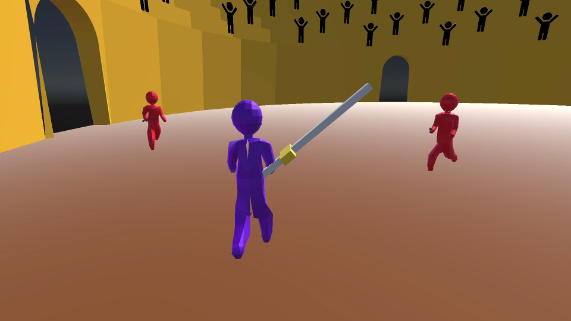

# Glory

My team's submission to a 12-hour Gamebuild-a-thon held ACM Gamebuilders at UIUC.
During the event I worked in a team of three to build a game following the theme of glory.

## Game Description

Glory is wave based survival game set in the Colosseum.
The player is a gladiator fighting to achieve glory.
Spear-carrying enemies charge foward in ever increasing waves to try to kill our gladiator.
If the player completes a wave without getting hit the audience will reward him upgraded
health, power, and sword length.
The game was developed in Unity featuring 3D graphics.

A video demonstration is available [here](https://youtu.be/jqyxbHrR4q8).